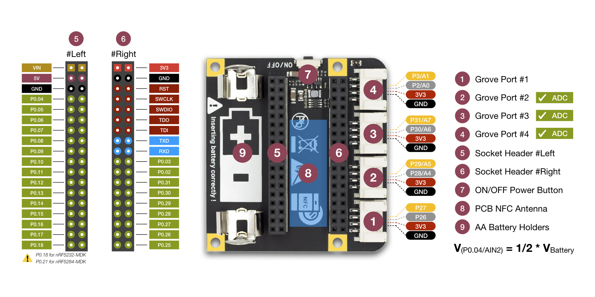

# Base Dock

> Grove compatible dock for building rapidly IoT applications with nRF52832-MDK or nRF52840-MDK

## Description

The Base Dock is an essential tool allowing you to build rapidly Internet of Things applications. It is an ideal add-on to the existing [nRF52832-MDK](https://wiki.makerdiary.com/nrf52832-mdk/) and [nRF52840-MDK](https://wiki.makerdiary.com/nrf52840-mdk/) development boards.

The Base Dock can be powered by only one [AA battery](http://www.energizer.com/batteries/energizer-ultimate-lithium-batteries), and it also features a power button and a PCB NFC antenna. It is also [Grove](https://www.seeedstudio.com/grove.html) compatible, which means you can connect easily and quickly sensors with the 4 Grove connectors.

For more about Grove, please visit [Seeed Studio Grove page](https://www.seeedstudio.com/grove.html).

## Features

* Work with [nRF52832-MDK](https://wiki.makerdiary.com/nrf52832-mdk/) and [nRF52840-MDK](https://wiki.makerdiary.com/nrf52840-mdk/) development boards
* Low-cost and convenient for Mesh Networking applications
* Grove compatible with hundreds of Grove modules supported
* NFC tag-A PCB Antenna available
* AA Battery power supply with step-up converter integrated
* Power Button with Latching Circuit
* Battery level sensing

## Hardware Specifications

* Dual 2x18 Socket Headers compatible with [nRF52832-MDK](https://wiki.makerdiary.com/nrf52832-mdk/) & [nRF52840-MDK](https://wiki.makerdiary.com/nrf52840-mdk/)
* 4 Grove connectors with UART/I2C/I2S/PDM/QDEC/SPI/ADC selectable
* NFC tag-A PCB Antenna available
* One Power Button with Latching Circuit
* AA Battery Holders
* Synchronous, Step-up Converter with VIN>VOUT Down Mode Operation
* 0.8V-to-4V Input Range
* 3.3V Output with Over-Current Protection
* Battery level sensing with 1:2 voltage divider on AIN2
* Low power consumption: 5uA Shutdown Current; 145uA Idle Current
* Measures 2.28" x 2.14" x 0.67" (58mm x 54mm x 17mm)

## Block diagram

## Developers Wiki

We have provided developers wiki to make it a pleasure to use Base Dock. 
Get what you need here or visit [https://wiki.makerdiary.com/base-dock](https://wiki.makerdiary.com/base-dock).

* [Getting Started](https://wiki.makerdiary.com/base-dock/getting-started)
* [Tutorials](https://wiki.makerdiary.com/base-dock/tutorials)
* [Hardware Resource](https://github.com/makerdiary/base-dock/tree/master/docs/hardware)

## Related Hardware

* [nRF52840-MDK](https://wiki.makerdiary.com/nrf52840-mdk) ---- [Get One!](https://store.makerdiary.com/collections/frontpage/products/nrf52840-mdk-iot-development-kit)

* [nRF52832-MDK](https://wiki.makerdiary.com/nrf52832-mdk) ---- [Get One!](https://store.makerdiary.com/collections/frontpage/products/nrf52832-mdk-iot-micro-development-kit)

## How to Get Base Dock?

Base Dock is available on the following channels (click to go directly to the product):

## MIT License

Copyright (c) 2018 [makerdiary](https://makerdiary.com)

Permission is hereby granted, free of charge, to any person obtaining a copy of this software and associated documentation files (the "Software"), to deal in the Software without restriction, including without limitation the rights to use, copy, modify, merge, publish, distribute, sublicense, and/or sell copies of the Software, and to permit persons to whom the Software is furnished to do so, subject to the following conditions:

The above copyright notice and this permission notice shall be included in all copies or substantial portions of the Software.

THE SOFTWARE IS PROVIDED "AS IS", WITHOUT WARRANTY OF ANY KIND, EXPRESS OR IMPLIED, INCLUDING BUT NOT LIMITED TO THE WARRANTIES OF MERCHANTABILITY, FITNESS FOR A PARTICULAR PURPOSE AND NONINFRINGEMENT. IN NO EVENT SHALL THE AUTHORS OR COPYRIGHT HOLDERS BE LIABLE FOR ANY CLAIM, DAMAGES OR OTHER LIABILITY, WHETHER IN AN ACTION OF CONTRACT, TORT OR OTHERWISE, ARISING FROM, OUT OF OR IN CONNECTION WITH THE SOFTWARE OR THE USE OR OTHER DEALINGS IN THE SOFTWARE.