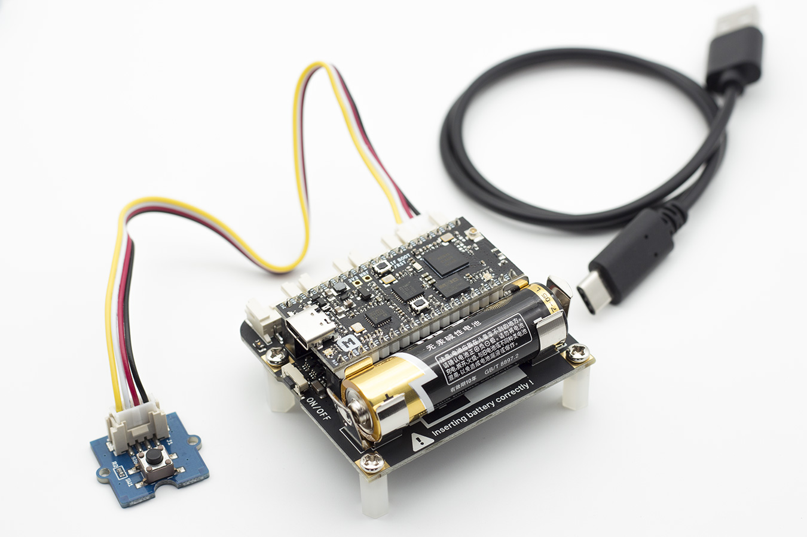
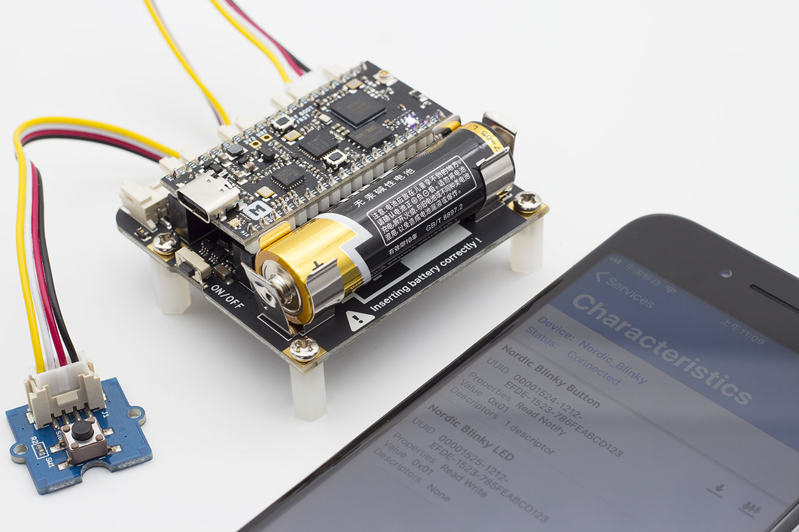

# Getting Started with Base Dock

This tutorial shows how to set up the Base Dock with an nRF52832-MDK or nRF52840-MDK development board in just a few minutes.

## Hardware Requirements

* [Base Dock Board](https://store.makerdiary.com/products/base-dock)
* [nRF52832-MDK](https://store.makerdiary.com/collections/frontpage/products/nrf52832-mdk-iot-micro-development-kit) or [nRF52840-MDK](https://store.makerdiary.com/collections/frontpage/products/nrf52840-mdk-iot-development-kit)
* A [Grove-Button](https://www.seeedstudio.com/Grove-Button-p-766.html) module
* [AA Battery](http://www.energizer.com/batteries/energizer-ultimate-lithium-batteries)
* Micro USB cable(for nRF52832-MDK), or Tpyc-C USB cable(for nRF52840-MDK)
* A smart phone with [nRF Connect App](https://www.nordicsemi.com/eng/Products/Nordic-mobile-Apps/nRF-Connect-for-Mobile) installed

## Assemble the hardware

1. Place the nRF52832-MDK or nRF52840-MDK board onto the Base Dock

2. Connect Grove-Button to Port#1 on Base Dock

3. Attach the four plastic spacers supplied in your box to act as legs for the Base Dock

4. Insert the AA battery into the holder the right way around as marked on the board



## Clone the repository

To clone the `base-dock` source code repository from GitHub:

``` sh
git clone --recursive https://github.com/makerdiary/base-dock
```

## Download the nRF5 SDK

Download the SDK package from [developer.nordicsemi.com](https://developer.nordicsemi.com/).

The current version we are using is `15.2.0`, it can be downloaded directly here: [nRF5_SDK_v15.2.0_9412b96.zip](https://www.nordicsemi.com/eng/nordic/download_resource/59011/94/96002302/116085)

Extract the zip file into the `base-dock/nrf_sdks/` directory. This should give you the following folder structure:

``` info
./base-dock
├── LICENSE.md
├── README.md
├── config
├── docs
├── examples
├── external
├── material
├── mkdocs.yml
└── nrf_sdks
    ├── README.md
    └── nRF5_SDK_15.2.0_9412b96
```

## Install GNU Arm Embedded Toolchain

Download and install a [GNU ARM Embedded](https://developer.arm.com/open-source/gnu-toolchain/gnu-rm) build for your operating system and extract it on your file system.

!!! note
	The current version we are using is `6-2017-q2-update`.

Config the toolchain path in `makefile.windows` or `makefile.posix` depending on platform you are using. That is, the `.posix` should be edited if your are working on either Linux or macOS. These files are located in:

``` sh
<nRF5 SDK>/components/toolchain/gcc
```

Open the file in a text editor and make sure that the `GNU_INSTALL_ROOT` variable is pointing to your GNU Arm Embedded Toolchain install directory. For example:

``` sh
GNU_INSTALL_ROOT := $(HOME)/gcc-arm-none-eabi/gcc-arm-none-eabi-6-2017-q2-update/bin/
GNU_VERSION := 6.3.1
GNU_PREFIX := arm-none-eabi
```

## Build and Run an Example

Next, you can build the examples provided with the `base-dock` repo. The following steps show how to build and run the `ble_app_blinky` example:

1. Navigate to the example directory:

	``` sh
	# For nRF52832-MDK board
	$ cd ./base-dock/examples/ble_app_blinky/nrf52832_mdk/armgcc

	# For nRF52840-MDK board
	$ cd ./base-dock/examples/ble_app_blinky/nrf52840_mdk/armgcc
	```


2. Connect nRF52832-MDK or nRF52840-MDK to your PC

3. Build the example and flash to the board

	``` sh
	$ make flash_all
	```

4. Open nRF Connect App and start scanning, a device called *Nordic_Blinky* will be found! 

5. Connect `Nordic_Blinky` device, and start to test the LED and Button service.

6. The device can be powered by the AA battery after removing the USB cable!



## More Tutorials

Please visit [Tutorials](../tutorials) page for more examples. If you don't see what you're looking for, you can [Request a tutorial](https://github.com/makerdiary/base-dock/issues/new?title=Tutorial%20Request:%20%3Ctitle%3E&body=Description%0A%0ATechnical%20Level%0Abeginner%20%7C%20intermediate%20%7C%20advanced%0A%0ALength%0Ashort%20(%3C%20250%20words)%20%7C%20medium%20(250-500%20words)%20%7C%20long%20(1000%20words+)%0A). We'd love to see your feedback!


## Create an Issue

Interested in contributing to this project? Want to report a bug? Feel free to click here:

<a href="https://github.com/makerdiary/base-dock/issues/new"><button data-md-color-primary="marsala"><i class="fa fa-github"></i> Create an Issue</button></a>

