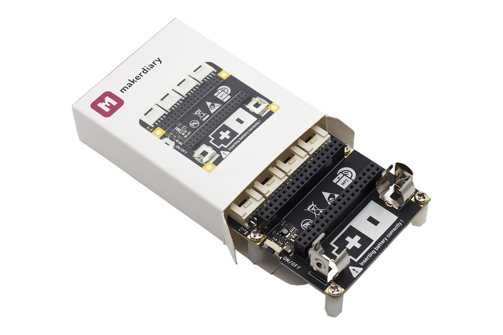

# Base Dock  <small>Grove compatible dock for building rapidly IoT applications with nRF52832-MDK or nRF52840-MDK</small>

## Description

The Base Dock is an essential tool allowing you to build rapidly Internet of Things applications. It is an ideal add-on to the existing [nRF52832-MDK](https://wiki.makerdiary.com/nrf52832-mdk/) and [nRF52840-MDK](https://wiki.makerdiary.com/nrf52840-mdk/) development boards.

The Base Dock can be powered by only one [AA battery](http://www.energizer.com/batteries/energizer-ultimate-lithium-batteries), and it also features a power button and a PCB NFC antenna. It is also [Grove](https://www.seeedstudio.com/grove.html) compatible, which means you can connect easily and quickly sensors with the 4 Grove connectors.

For more about Grove, please visit [Seeed Studio Grove page](https://www.seeedstudio.com/grove.html).

## Features

* Work with [nRF52832-MDK](https://wiki.makerdiary.com/nrf52832-mdk/) and [nRF52840-MDK](https://wiki.makerdiary.com/nrf52840-mdk/) development boards
* Low-cost and convenient for Mesh Networking applications
* Grove compatible with hundreds of Grove modules supported
* NFC tag-A PCB Antenna available
* AA Battery power supply with step-up converter integrated
* Power Button with Latching Circuit
* Battery level sensing

## Hardware Specifications

* Dual 2x18 Socket Headers compatible with [nRF52832-MDK](https://wiki.makerdiary.com/nrf52832-mdk/) & [nRF52840-MDK](https://wiki.makerdiary.com/nrf52840-mdk/)
* 4 Grove connectors with UART/I2C/I2S/PDM/QDEC/SPI/ADC selectable
* NFC tag-A PCB Antenna available
* One Power Button with Latching Circuit
* AA Battery Holders
* Synchronous, Step-up Converter with VIN>VOUT Down Mode Operation
* 0.8V-to-4V Input Range
* 3.3V Output with Over-Current Protection
* Battery level sensing with 1:2 voltage divider on AIN2
* Low power consumption: 5uA Shutdown Current; 145uA Idle Current
* Measures 2.28" x 2.14" x 0.67" (58mm x 54mm x 17mm)

## Block diagram

## Hardware Resource

| Releases | Design Files                   |
| -------- | ------------------------------ |
| V1.0     | [Base Dock V1.0 Block Diagram](hardware/base-dock-block-diagram_v1_0.pdf) [Base Dock V1.0 Schematic](hardware/base-dock-schematic_v1_0.pdf) [Base Dock V1.0 Board File](hardware/base-dock-board-file_v1_0.pdf)|

## Related Products

| **nRF52840-MDK** | **nRF52832-MDK** |
|:---:|:---:|
|  <a href="https://store.makerdiary.com/collections/frontpage/products/nrf52840-mdk-iot-development-kit"><button data-md-color-primary="marsala">Get One!</button></a> |  <a href="https://store.makerdiary.com/collections/frontpage/products/nrf52832-mdk-iot-micro-development-kit"><button data-md-color-primary="marsala">Get One!</button></a> |

## Create an Issue

Interested in contributing to this project? Want to report a bug? Feel free to click here:

<a href="https://github.com/makerdiary/base-dock/issues/new"><button data-md-color-primary="marsala"><i class="fa fa-github"></i> Create an Issue</button></a>

