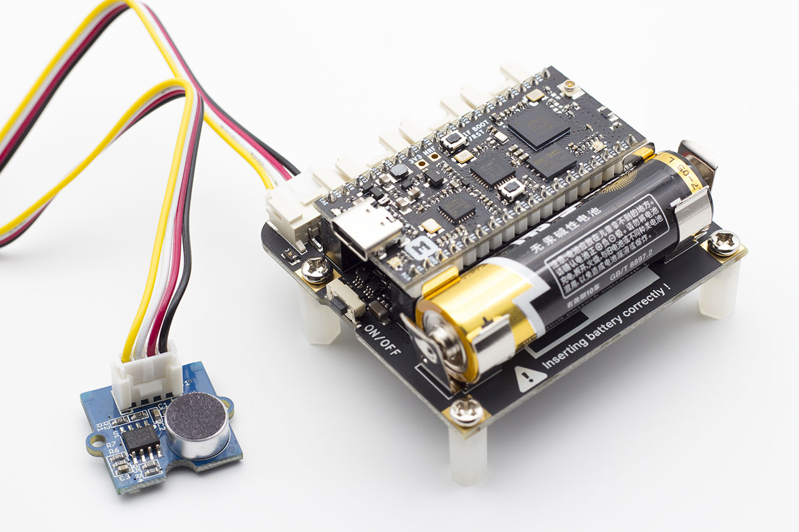
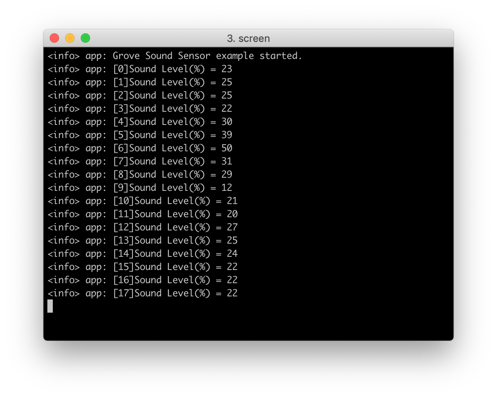

# Grove - Sound Sensor Tutorial

This tutorial shows how to use Grove-Sound Sensor module with Base Dock.

## Requirements

* [Base Dock Board](https://store.makerdiary.com/products/base-dock)
* [nRF52832-MDK](https://store.makerdiary.com/collections/frontpage/products/nrf52832-mdk-iot-micro-development-kit) or [nRF52840-MDK](https://store.makerdiary.com/collections/frontpage/products/nrf52840-mdk-iot-development-kit)
* A [Grove - Sound Sensor](https://www.seeedstudio.com/Grove-Sound-Sensor-p-752.html) module
* [AA Battery](http://www.energizer.com/batteries/energizer-ultimate-lithium-batteries)
* Micro USB cable(for nRF52832-MDK), or Tpyc-C USB cable(for nRF52840-MDK)

## Connect the hardware

Connect Grove-Sound Sensor to Port#4 on the Base Dock, and then insert the battery.



## Build and Run the Example

The following steps show how to build and run the `grove-sound_sensor` example:

1. Navigate to the example directory:

	``` sh
	# For nRF52832-MDK board
	$ cd ./base-dock/examples/grove-sound_sensor/nrf52832_mdk/armgcc

	# For nRF52840-MDK board
	$ cd ./base-dock/examples/grove-sound_sensor/nrf52840_mdk/armgcc
	```


2. Connect nRF52832-MDK or nRF52840-MDK to your PC.

3. Build the example and flash to the board.

	``` sh
	$ make flash_all
	```

4. Start a terminal application like [PuTTY](https://www.chiark.greenend.org.uk/~sgtatham/putty/) or [screen](https://www.gnu.org/software/screen/manual/screen.html) and establish a UART connection.

	``` sh
	$ screen /dev/cu.usbmodem142310 115200
	```

5. The sound sensor output will be printed on the console.



## Create an Issue

Interested in contributing to this project? Want to report a bug? Feel free to click here:

<a href="https://github.com/makerdiary/base-dock/issues/new"><button data-md-color-primary="marsala"><i class="fa fa-github"></i> Create an Issue</button></a>

