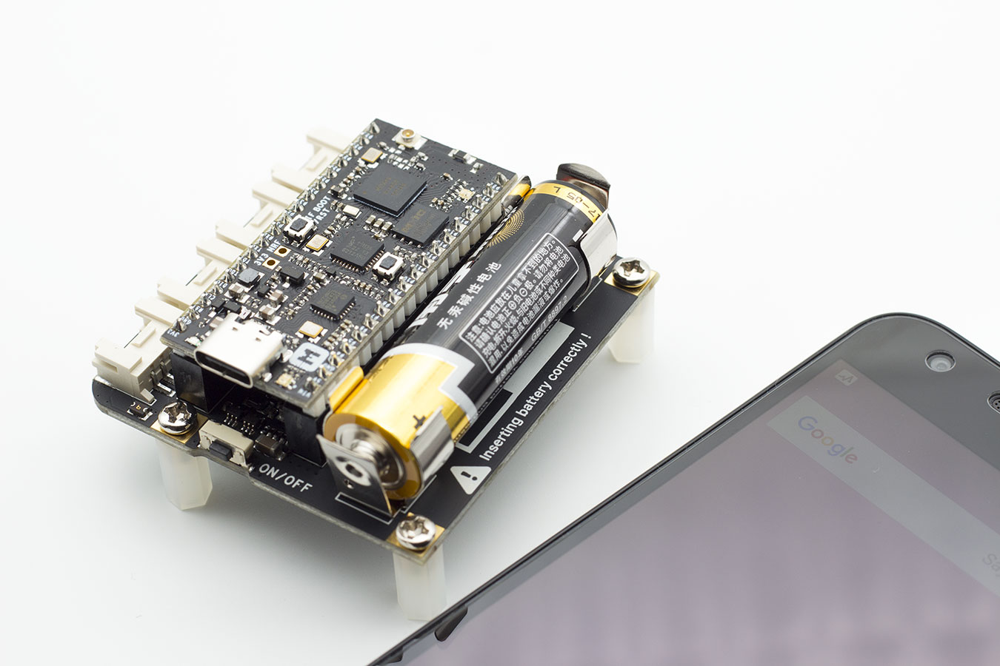

# Launch App using NFC

This tutorial shows how to use the NFC Tag on the Base Dock to launch an Android app.

## Requirements

* [Base Dock Board](https://store.makerdiary.com/products/base-dock)
* [nRF52832-MDK](https://store.makerdiary.com/collections/frontpage/products/nrf52832-mdk-iot-micro-development-kit) or [nRF52840-MDK](https://store.makerdiary.com/collections/frontpage/products/nrf52840-mdk-iot-development-kit)
* [AA Battery](http://www.energizer.com/batteries/energizer-ultimate-lithium-batteries)
* Micro USB cable(for nRF52832-MDK), or Tpyc-C USB cable(for nRF52840-MDK)
* An Android phone with NFC(like Nexus 5X)

## Prepare the hardware

 Insert the AA battery into the holder the right way around as marked on the board.



## Build and Run the Example

The following steps show how to build and run the `nrf_record_launch_app` example:

1. Navigate to the example directory:

	``` sh
	# For nRF52832-MDK board
	$ cd ./base-dock/examples/nrf_record_launch_app/nrf52832_mdk/armgcc

	# For nRF52840-MDK board
	$ cd ./base-dock/examples/nrf_record_launch_app/nrf52840_mdk/armgcc
	```


2. Connect nRF52832-MDK or nRF52840-MDK to your PC.

3. Build the example and flash to the board.

	``` sh
	$ make flash_all
	```

4. The board can be powered by the AA battery after removing the USB cable!

5. Touch the top of the board using your Android phone.

<iframe width="680" height="400" src="https://www.youtube.com/embed/TtZ5xykfr8k" frameborder="0" allow="accelerometer; autoplay; encrypted-media; gyroscope; picture-in-picture" allowfullscreen></iframe>

## Create an Issue

Interested in contributing to this project? Want to report a bug? Feel free to click here:

<a href="https://github.com/makerdiary/base-dock/issues/new"><button data-md-color-primary="marsala"><i class="fa fa-github"></i> Create an Issue</button></a>

